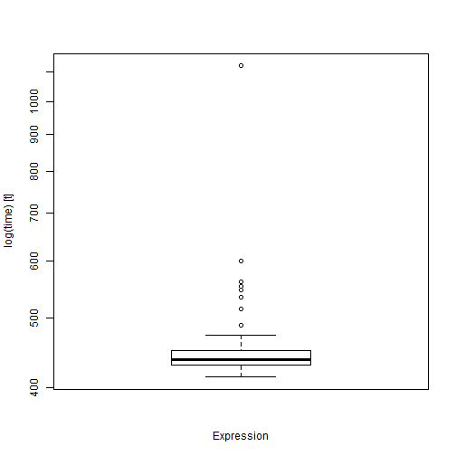

```r
library(dplyr)
library(ggplot2)
```

## Purpose
Using Newton’s Method to implement logistic regression on a classification problem.

## Chosen dataset
In order to test the implementation of the required functions for this project, the following dataset has been chosen: 
40 students who were admitted to college and 40 students who were not admitted, and their corresponding grades for 2 exams.


```r
exam_x = read.delim("data/ex4x.dat", sep = " ")
exam_y = read.delim("data/ex4y.dat")

# cleaning the data 
exam_x <- exam_x[ ,c(4, 7)]
colnames(exam_x) <- c("test1", "test2")
colnames(exam_y) <- "admitted"
exam_df <- dplyr::bind_cols(exam_x, exam_y)
```

Plotting the data

```r
ggplot2::ggplot(exam_df, ggplot2::aes(x = test1, y = test2, col = as.factor(admitted))) +
  ggplot2::geom_point()
```


###  1. Maximum log-likelihood using Newton-Raphson algorithm 
basic.mle function takes as input argument the subset of the relevant variables and the variable to predict.
This function returns the maximum likelihood estimator. This estimator is given by a Newton-Raphson algorithm.
Newton’s method, similarly to gradient descent, is a way to search for the 0(minimum)
of the derivative of the cost function.
The method of maximum likelihood finds the values of the model parameter,
{\displaystyle \theta } \theta , that maximize the likelihood function,
{\displaystyle {\mathcal {L}}(\theta \,;x)} {\displaystyle {\mathcal {L}}(\theta \,;x)}.
Intuitively, this selects the parameter values that make the data most probable.

```r
g = function (z) {
  return (1 / (1 + exp(-z) ))
} # plot(g(c(1,2,3,4,5,6)))

# hypothesis 
h = function (x,th) {
  return( g(x %*% th) )
} # h(x,th)

# cost
J = function (x,y,th,m) {
  return( 1/m * sum(-y * log(h(x,th)) - (1 - y) * log(1 - h(x,th))) )
} # J(x,y,th,m)

# derivative of J (gradient)
grad = function (x,y,th,m) {
  return( 1/m * t(x) %*% (h(x, th) - y))
} # grad(x,y,th,m)

# Hessian
H = function (x,y,th,m) {
  return (1/m * t(x) %*% x * diag(h(x,th)) * diag(1 - h(x,th)))
} # H(x,y,th,m)

basic.mle <- function(x, y) {
  j = array(0, c(10,1))
  m = length(y)
  # eliminate matrix, use for to see what happens to the dataframe
  if (is.vector(x)) {
    x_copy <- dplyr::data_frame(x_var = x,
                                id = rep(1, length(x)))
   
  } else {
    x_copy <- x
    x_copy$id <- 1
  }
  
  x = as.matrix(x_copy)
  y_calc = matrix(y, ncol = 1)
  th = matrix(0, ncol(x))
  for (i in 1:10) {
    #update j at every iteration and keep only the last j calculated
    j = J(x, y, th, m) # stores each iteration Cost 
    th = th - solve(H(x, y_calc, th, m)) %*% grad(x, y_calc, th, m) 
  }
  th
}

theta <- basic.mle(exam_x, exam_y$admitted)

# -16.38
# 0.1483
# 0.1589
# Model = theta[1] + theta[2] * x$test1 + theta[3] * x$test_2
x_test <- c(20, 80, 1) 
y_test <- t(x_test) %*% theta
```

2. Implement the function basic.cv which takes as input argument the sample and the set of the relevant variables. This function returns the estimator of the error of prediction obtained by cross-validation for any subset of covariates by using the MLE of the model. Use only basic instructions (like loops) and do not use any optimization techniques. 


```r
# the function returrns the cv error for each fold
basic.cv <- function(sample, x_vars, y_var) {
  n_folds = 10
  set.seed(1)
  sample_copy <- sample[sample(nrow(sample)),]
  fold_size <- as.numeric(nrow(sample) / n_folds)
  folds <- c()
  for (fold in 1:n_folds) {
    fold_r = c()
    n <- 0
    while(n < fold_size) {
      fold_r <- c(fold_r, fold)
      n <- n + 1
    }
    folds <- c(folds, fold_r)
  }
  error_c <- c()

  for (i in 1:n_folds) {
    #Segement data by fold
    test_indexes <- which(folds == i, arr.ind = TRUE)
    test_data <-  test_data <- cbind(sample_copy[test_indexes, ], 
                                     data.frame(intercept = rep(1, length(test_indexes))))
    train_data <- sample_copy[-test_indexes, ]

    # train model using basic.mle
    thetas <- basic.mle(train_data[,x_vars], train_data[[y_var]])
    x_vars2 <- c(x_vars, "intercept")

    # use thetas to predict the model in test_data
    predicted_y <- c()
    for (k in 1:nrow(test_data)) {
      mat_test <- as.matrix(test_data[k, x_vars2])
      sum <- 0
      for(l in 1:length(thetas)) {
        sum <- sum + mat_test[l] * thetas[l]
      }
      predicted_y[k] <- sum
    #  predicted_y[k] <- mat_test %*% thetas
      predicted_y[k] <- ifelse(predicted_y[k] > 0.5, 1, 0)
    }
    # calculate error
    wrong <- (predicted_y != test_data[[y_var]])
    count_wrong <- sum(wrong)
    error_c[i] <- count_wrong/nrow(test_data)
  }
  mean(error_c)
}


exam_df_c <- exam_df %>%
  dplyr::mutate(test3 = test2 ^ 2)
x <- basic.cv(exam_df_c, c("test1", "test2", "test3"), "admitted")
x2 <- basic.cv(exam_df_c, c("test1", "test2"), "admitted")
x3 <-  basic.cv(exam_df_c, c("test1"), "admitted")
```

3. Implement the function basic.modelcomparison which takes as input argument the 
sample and a set of competing models. This function returns the best model 
(i.e., the subset of the relevant variables) and its estimator of the prediction error. 
Use only basic instructions (like loops) and do not use any optimization techniques. 


```r
# models argument is a list containing models as a form of named lists containing two vectors:
# predictors and predicted
# models argument is a list containing models as a form of named lists containing two vectors:
# predictors and predicted
model1 <- 
  list(
    predictors = c("test1"),
    predicted = c("admitted"))
model2 <- 
  list(
    predictors = c("test1", "test2"),
    predicted = c("admitted"))

models_list <- list()
models_list[[1]] <- model1
models_list[[2]] <- model2
# Better: purr parr aplly on list, calc cv for each element, which.min error
basic.modelcomparison <- function(sample, models) {
  if (length(models) < 2) {
    stop("models list should contain at least two models!")
  }
  # initialise cv error with a very big value in order to calculate minimum
  min_cv <- 100
  for (i in 1:length(models)) {
    cv_error <- basic.cv(
      sample, 
      models[[i]]$predictors,
      models[[i]]$predicted)
    if (cv_error < min_cv) { 
      min_cv <- cv_error
      index <- i
    }
  }
  best_cv <- list(
    best_model = models[[index]], 
    cv_error = min_cv)
  return(best_cv)
  
}

# add another variable to the dataset to illustrate the way function 
# works
exam_df_c <- exam_df %>%
  dplyr::mutate(test3 = test2 ^ 2)
best <- basic.modelcomparison(exam_df_c, models_list)
```


4. Implement the function basic.modelselection which takes as input argument the sample
and the direction (backward or forward). This function returns the best model 
(i.e., the subset of the relevant variables) and its estimator of the prediction error.
Use only basic instructions (like loops) and do not use any optimization techniques.


Forward Stepwise Selection considers a much smaller subset of p predictors. 
It begins with a model containing no predictors, then adds predictors to the model, 
one at a time until all of the predictors are in the model. The order of the variables being added is the variable, which gives the greatest addition improvement to the fit, until no more variables improve model fit using cross-validated prediction error. A best subset model for p = 20 would have to fit 1 048 576 models, where as forward step wise only requires fitting 211 potential models. However, this method is not guaranteed to find the model. Forward stepwise regression can even be applied in the high-dimensional setting where p > n.

Backward Stepwise Selection begins will all p predictors in the model, then iteratively removes the least useful predictor one at a time. Requires that n > p.


 The p-value for each independent variable tests the null hypothesis that the variable has no correlation with the dependent variable. If there is no correlation, there is no association between the changes in the independent variable and the shifts in the dependent variable. In other words, there is insufficient evidence to conclude that there is effect at the population level.
 
p pt a stice varibila adaugi/scoti
cv pt a sti unde te opresti


```r
basic.modelselection <- function(sample, method, y_var) {
  
  sample_df_x <- exam_df_c[,!(names(exam_df_c) == y_var)]
  
  all_vars <- list(predictors = colnames(sample_df_x),
                   predicted = c(y_var))
  # start with an empyt model for forward selection, 
  # we decide which is the initial variable 
  # included in the model based on min cv error
  cv <- c()
  names_of_df <- colnames(sample_df_x)
  for (i in 1:ncol(sample_df_x)) {
    cv[i] <- basic.cv(sample, names_of_df[i], y_var)
  }
  min_cv_idx <- which.min(cv)
  included <- list(
    predictors = c(names_of_df[min_cv_idx]),
    predicted = c(y_var)
  )
  
while (TRUE) {
  changed <- FALSE
  excluded <- setdiff(all_vars$predictors, included$predictors)
  # forward step
  best_cv <- c()
  best_model <- list()
  for (i in 1:length(excluded)) {
    model_predictors <- c(included$predictors, excluded[i])
    model <- list(predictors = model_predictors,
                  predicted = c(y_var))
    ## creare model, calcul
    final_model <- list()
    anterior_model <- included
    new_model <- model
    final_model[[1]] <- anterior_model
    final_model[[2]] <- new_model
    model_comparison <- basic.modelcomparison(sample, final_model)
    best_cv[i] <- model_comparison$cv_error
    best_model[[i]] <- model_comparison$best_model
    
  }
  min_cv_index <- which.min(best_cv)
  comparing_array <-
    best_model[[min_cv_index]]$predictors == included$predictors
  if (all(comparing_array == TRUE)) {
    changed <- FALSE
    bm$predictors <- included$predictors
    bm$predicted <- included$predicted
    cv2 <- cv[which.min(cv)]
    res <- list(best_model = bm,
                cv_error = cv2)
  
  } else {
    bm <- list()
    included <- best_model[[min_cv_index]]
    cv <- best_cv[[min_cv_index]]
    bm$predictors <- included$predictors
    bm$predicted <- included$predicted
    res <- list(best_model = bm,
                cv_error = cv)
    changed <- TRUE
  }
  
  if (changed == FALSE) {
    break
  }
}
  res
}

basic.modelselection(exam_df_c, "forward", "admitted")
```

```
## $best_model
## $best_model$predictors
## [1] "test1" "test2"
## 
## $best_model$predicted
## [1] "admitted"
## 
## 
## $cv_error
## [1] 0.225
```


### Code monitoring

#### basic.mle code monitoring


```r
library(microbenchmark)
library(aprof)
dump("basic.mle", file="basic_mle.R")
source("basic_mle.R")

Rprof("monprofil.Rout",
line.profiling = TRUE,
interval = 0.01)
theta <- basic.mle(exam_x, exam_y$admitted)
Rprof(append=FALSE)

basic_mle_aprof <- aprof("basic_mle.R", "monprofil.Rout")
plot(basic_mle_aprof)
```

```
## Warning in readLineDensity(aprofobject, Memprof = AddMemProf): specified source
##       file basic_mle.R is not in the list of files in the
##       profiler output: 
##  <text>
```

```
## Warning in readLineDensity(aprofobject, Memprof = AddMemProf): Some aprof functions may fail --> user supplied source filebasic_mle.R does not seem to correspond to any file in the profiler output.
##  Possible causes: 
## 1) Source file was not profiled?
## 2) Spelling?
```

```
## Warning in readLineDensity(aprofobject, Memprof = AddMemProf): Some line
## calls stripped - BUGCODE: 02022016
```

```
## Error in xy.coords(x, y, xlabel, ylabel, log): 'x' and 'y' lengths differ
```

```r
Rprof(NULL)
file.remove("Rprof.out")
```

```
## [1] TRUE
```

```r
file.remove("monprofil.Rout")
```

```
## [1] TRUE
```

```r
file.remove("basic_mle.R")
```

```
## [1] TRUE
```

```r
#system.time(theta <- basic.mle(exam_x, exam_y$admitted))
#out <- microbenchmark(theta <- basic.mle(exam_x, exam_y$admitted), unit = "ms")
#boxplot(out)
```


#### basic.cv code monitoring
As it can be noticed from the aprof plot output, the most demanding lines are the one that
is calling the function basic.mle as well as the line transforming a dataframe into a matrix.
On the further section, we will try to find an alternative for the matrix transformation.


```r
exam_df_c <- exam_df %>%
  dplyr::mutate(test3 = test2 ^ 2)
out <- microbenchmark(x <- basic.cv(exam_df_c, c("test1", "test2", "test3"), "admitted"), unit = "ms")
boxplot(out)
```


```r
dump("basic.cv", file="basic_cv.R")
source("basic_cv.R")

Rprof("monprofil2.Rout",
line.profiling = TRUE,
interval = 0.01)
x <- basic.cv(exam_df_c, c("test1"), "admitted")
Rprof(append=FALSE)

basic_cv_aprof <- aprof("basic_cv.R", "monprofil2.Rout")
plot(basic_cv_aprof)
```

```
## Warning in readLineDensity(aprofobject, Memprof = AddMemProf): specified source
##       file basic_cv.R is not in the list of files in the
##       profiler output: 
##  <text>
```

```
## Warning in readLineDensity(aprofobject, Memprof = AddMemProf): Some aprof functions may fail --> user supplied source filebasic_cv.R does not seem to correspond to any file in the profiler output.
##  Possible causes: 
## 1) Source file was not profiled?
## 2) Spelling?
```

```
## Warning in readLineDensity(aprofobject, Memprof = AddMemProf): Some line
## calls stripped - BUGCODE: 02022016
```

```
## Error in xy.coords(x, y, xlabel, ylabel, log): 'x' and 'y' lengths differ
```

```r
Rprof(NULL)
file.remove("Rprof.out")
```

```
## [1] TRUE
```

```r
file.remove("monprofil2.Rout")
```

```
## [1] TRUE
```

```r
file.remove("basic_cv.R")
```

```
## [1] TRUE
```


#### basic.modelcomparison code monitoring


```r
exam_df_c <- exam_df %>%
  dplyr::mutate(test3 = test2 ^ 2)
# out <- microbenchmark(best <- basic.modelcomparison(exam_df_c, models_list), unit = "ms")
# boxplot(out)

dump("basic.modelcomparison", file="basic_modelcomparison.R")
source("basic_modelcomparison.R")

Rprof("monprofil3.Rout",
      line.profiling = TRUE,
      interval = 0.01)
best <- basic.modelcomparison(exam_df_c, models_list)
Rprof(append=FALSE)

basic_mc_aprof <- aprof("basic_modelcomparison.R", "monprofil3.Rout")
plot(basic_mc_aprof)
```

```
## Warning in readLineDensity(aprofobject, Memprof = AddMemProf): specified source
##       file basic_modelcomparison.R is not in the list of files in the
##       profiler output: 
##  <text>
```

```
## Warning in readLineDensity(aprofobject, Memprof = AddMemProf): Some aprof functions may fail --> user supplied source filebasic_modelcomparison.R does not seem to correspond to any file in the profiler output.
##  Possible causes: 
## 1) Source file was not profiled?
## 2) Spelling?
```

```
## Warning in readLineDensity(aprofobject, Memprof = AddMemProf): Some line
## calls stripped - BUGCODE: 02022016
```

```
## Error in xy.coords(x, y, xlabel, ylabel, log): 'x' and 'y' lengths differ
```

```r
Rprof(NULL)
file.remove("Rprof.out")
```

```
## [1] TRUE
```

```r
file.remove("monprofil3.Rout")
```

```
## [1] TRUE
```

```r
file.remove("basic_modelcomparison.R")
```

```
## [1] TRUE
```


#### basic.modelselection code monitoring


```r
out <- microbenchmark(basic.modelselection(exam_df_c, "forward", "admitted"), unit = "ms")
boxplot(out)
```



```r
dump("basic.modelselection", file="basic_modelselection.R")
source("basic_modelselection.R")

Rprof("monprofil4.Rout",
line.profiling = TRUE,
interval = 0.01)
basic.modelselection(exam_df_c, "forward", "admitted")
```

```
## $best_model
## $best_model$predictors
## [1] "test1" "test2"
## 
## $best_model$predicted
## [1] "admitted"
## 
## 
## $cv_error
## [1] 0.225
```

```r
Rprof(append=FALSE)

basic_ms_aprof <- aprof("basic_modelselection.R", "monprofil4.Rout")
plot(basic_ms_aprof)
```

```
## Warning in readLineDensity(aprofobject, Memprof = AddMemProf): specified source
##       file basic_modelselection.R is not in the list of files in the
##       profiler output: 
##  <text>
```

```
## Warning in readLineDensity(aprofobject, Memprof = AddMemProf): Some aprof functions may fail --> user supplied source filebasic_modelselection.R does not seem to correspond to any file in the profiler output.
##  Possible causes: 
## 1) Source file was not profiled?
## 2) Spelling?
```

```
## Warning in readLineDensity(aprofobject, Memprof = AddMemProf): Some line
## calls stripped - BUGCODE: 02022016
```

```
## Error in xy.coords(x, y, xlabel, ylabel, log): 'x' and 'y' lengths differ
```

```r
Rprof(NULL)
file.remove("Rprof.out")
```

```
## [1] TRUE
```

```r
file.remove("monprofil4.Rout")
```

```
## [1] TRUE
```

```r
file.remove("basic_modelselection.R")
```

```
## [1] TRUE
```


### Alternatives


### Cross validation function improvement


```r
# first step to improve the basic.cv function is to create 
# folds using the cut function. This way, the iteration with for loop
# through the dataset is no longer required

# another for loop is eliminated by calculating the dot product between
# current observation
# and thetas directly by using the vectorial product %*%

# secondly, assign space statically for every new variable created
# by giving the exact length at initialisation

basic.cv1 <- function(sample, x_vars, y_var) {
  
  n_folds = 10
  set.seed(1)
  sample_copy <- sample[sample(nrow(sample)), ]
  folds <- cut(seq(1, nrow(sample_copy)), breaks = 10, labels = FALSE)
  error_c <- numeric(n_folds)
  
  for (i in 1:n_folds) {
    
    #Segement data by fold
    test_indexes <- which(folds == i, arr.ind = TRUE)
    test_data <-  sample_copy[test_indexes, ]
    train_data <- sample_copy[-test_indexes, ]
    
    # train model using basic.mle
    thetas <- basic.mle(train_data[,x_vars], train_data[,y_var])
    test_data$intercept <- 1
    x_vars2 <- c(x_vars, "intercept")
    
    # use thetas to predict the model in test_data
    predicted_y <- numeric(nrow(test_data))
    for (k in 1:nrow(test_data)) {
    
      mat_test <- as.matrix(test_data[k, x_vars2])
      predicted_y[k] <- ifelse(mat_test %*% thetas > 0.5, 1, 0)
    }

    # calculate error
    wrong <- (predicted_y != test_data[[y_var]])
    count_wrong <- sum(wrong)
    error_c[i] <- count_wrong/nrow(test_data)
  }
  mean(error_c)
}
```


```r
# For the second approach, instead of looping through each
# row of the dataframe, transforming it into a matrix at each
# iteration (which is time consuming, as seen with aprof)
# and calculated the dot product, we directly multply the 
# matrix to thetas (vectorial product)
basic.cv2 <- function(sample, x_vars, y_var) {
  
  n_folds = 10
  set.seed(1)
  sample_copy <- sample[sample(nrow(sample)), ]
  folds <- cut(seq(1, nrow(sample_copy)), breaks = 10, labels = FALSE)
  error_c <- numeric(n_folds)
  
  for (i in 1:n_folds) {
    
    #Segement data by fold
    test_indexes <- which(folds == i, arr.ind = TRUE)
    test_data <-  sample_copy[test_indexes, ]
    train_data <- sample_copy[-test_indexes, ]
    
    # train model using basic.mle
    thetas <- basic.mle(train_data[,x_vars], train_data[,y_var])
    test_data$intercept <- 1
    x_vars2 <- c(x_vars, "intercept")
    
    # use thetas to predict the model in test_data
    predicted_y <- numeric(nrow(test_data))
    mat_test <- as.matrix(test_data[, x_vars2])
    predicted_y <- ifelse(mat_test %*% thetas > 0.5, 1, 0)
    
    # calculate error
    wrong <- (predicted_y != test_data[[y_var]])
    count_wrong <- sum(wrong)
    error_c[i] <- count_wrong/nrow(test_data)
  }
  mean(error_c)
}
```


```r
# the third approach is based on parrallelisation
# of task on 3 cores for the most part of the function

library(parallel)
no_cores <- detectCores() - 1
cl <- makeCluster(no_cores)

basic.cv3 <- function(sample, x_vars, y_var) {
  n_folds = 10
  set.seed(1)
  sample_copy <- sample[sample(nrow(sample)), ]
  folds <- cut(seq(1, nrow(sample_copy)), breaks = 10, labels = FALSE)
  error_c <- numeric(n_folds)

  clusterExport(cl, 
                c("sample_copy", "x_vars", "y_var", "folds", "basic.mle", 
                  "J", "h", "g", "H", "grad"),
                envir = environment())
  
  error_c <- parLapply(cl, 1:n_folds,
            function(i) {
              #Segement data by fold
              test_indexes <- which(folds == i, arr.ind = TRUE)
              test_data <-  sample_copy[test_indexes, ]
              train_data <- sample_copy[-test_indexes, ]
              
              # train model using basic.mle
              thetas <- basic.mle(train_data[,x_vars], train_data[,y_var])
              test_data$intercept <- 1
              x_vars2 <- c(x_vars, "intercept")
              
              # use thetas to predict the model in test_data
              predicted_y <- numeric(nrow(test_data))
              mat_test <- as.matrix(test_data[, x_vars2])
              predicted_y <- ifelse(mat_test %*% thetas > 0.5, 1, 0)
              
              # calculate error
              wrong <- (predicted_y != test_data[[y_var]])
              count_wrong <- sum(wrong)
              count_wrong/nrow(test_data)
            })
 
  return(mean(unlist(error_c)))
  on.exit(stopCluster(cl))
}
```


As it can be noticed, parrallelisation does outperform the
original function, but it is not do better than the other optimised versions.

```r
exam_df_c <- exam_df %>%
  dplyr::mutate(test3 = test2 ^ 2)

set.seed(1)
x <- basic.cv(exam_df_c, c("test1", "test2", "test3"), "admitted")
x1 <- basic.cv1(exam_df_c, c("test1", "test2", "test3"), "admitted")
all.equal(x, x1)
```

```
## [1] TRUE
```

```r
x <- basic.cv(exam_df_c, c("test1", "test2", "test3"), "admitted")
x2 <- basic.cv2(exam_df_c, c("test1", "test2", "test3"), "admitted")
all.equal(x, x2)
```

```
## [1] TRUE
```

```r
x <- basic.cv(exam_df_c, c("test1", "test2", "test3"), "admitted")
x3 <- basic.cv3(exam_df_c, c("test1", "test2", "test3"), "admitted")
all.equal(x, x3)
```

```
## [1] TRUE
```

```r
microbenchmark(
  x <- basic.cv(exam_df_c, c("test1", "test2", "test3"), "admitted"),
  x1 <- basic.cv1(exam_df_c, c("test1", "test2", "test3"), "admitted"),
  x2 <- basic.cv2(exam_df_c, c("test1", "test2", "test3"), "admitted"),
  x3 <- basic.cv3(exam_df_c, c("test1", "test2", "test3"), "admitted"))
```

```
## Unit: milliseconds
##                                                                  expr
##    x <- basic.cv(exam_df_c, c("test1", "test2", "test3"), "admitted")
##  x1 <- basic.cv1(exam_df_c, c("test1", "test2", "test3"), "admitted")
##  x2 <- basic.cv2(exam_df_c, c("test1", "test2", "test3"), "admitted")
##  x3 <- basic.cv3(exam_df_c, c("test1", "test2", "test3"), "admitted")
##       min        lq      mean    median        uq      max neval
##   43.4711  45.02220  51.53217  49.96025  54.92990  86.5708   100
##   40.3538  43.07515  48.04745  45.88250  50.93315  99.3505   100
##   26.0136  27.06625  30.02534  29.32320  31.21460  45.8472   100
##  279.0583 294.23195 303.77822 299.26380 307.70185 399.4801   100
```


### Model Comparison function improvement


```r
# Better: purr parr aplly on list, calc cv for each element, which.min error
basic.modelcomparison1 <- function(sample, models) {
  if (length(models) < 2) {
    stop("models list should contain at least two models!")
  }
  
  cv_error <- numeric(length(models))
  for (i in 1:length(models)) {
    cv_error[i] <- basic.cv2(
      sample, 
      models[[i]]$predictors,
      models[[i]]$predicted)
  }
  index <- which.min(cv_error)
  return(list(
    best_model = models[[index]], 
    cv_error = cv_error[index]))
 
}
```


```r
no_cores <- detectCores() - 1
cl <- makeCluster(no_cores)

basic.modelcomparison2 <- function(sample, models) {
  if (length(models) < 2) {
    stop("models list should contain at least two models!")
  }
  clusterExport(cl, 
                c("sample", "models", "basic.cv", "basic.mle", 
                  "J", "h", "g", "H", "grad"),
                envir = environment())
  cv_error <- parLapply(cl, 1:length(models),
                       function(i)  {
                           basic.cv(
                           sample, 
                           models[[i]]$predictors,
                           models[[i]]$predicted)
                       })
  index <- which.min(cv_error)
  return(list(
    best_model = models[[index]], 
    cv_error = cv_error[index]))
  on.exit(stopCluster(cl))
}

model1 <- 
  list(
    predictors = c("test1"),
    predicted = c("admitted"))
model2 <- 
  list(
    predictors = c("test1", "test2"),
    predicted = c("admitted"))

models_list <- list(list(
  predictors = c("test1"),
  predicted = c("admitted")),
  list(
    predictors = c("test1", "test2"),
    predicted = c("admitted"))
)
```


```r
# add another variable to the dataset to illustrate the way function 
# works
exam_df_c <- exam_df %>%
  dplyr::mutate(test3 = test2 ^ 2)
best <- basic.modelcomparison(exam_df_c, models_list)
best <- basic.modelcomparison1(exam_df_c, models_list)
all.equal(best, best1) 
```

```
## Error in mode(current): object 'best1' not found
```

```r
best2 <- basic.modelcomparison2(exam_df_c, models_list)
all.equal(best, best2)
```

```
## [1] "Component \"cv_error\": Modes: numeric, list"              
## [2] "Component \"cv_error\": target is numeric, current is list"
```

```r
microbenchmark(
  best <- basic.modelcomparison(exam_df_c, models_list),
  best1 <- basic.modelcomparison1(exam_df_c, models_list),
  best2 <- basic.modelcomparison2(exam_df_c, models_list))
```

```
## Unit: milliseconds
##                                                     expr      min
##    best <- basic.modelcomparison(exam_df_c, models_list)  88.7021
##  best1 <- basic.modelcomparison1(exam_df_c, models_list)  57.1272
##  best2 <- basic.modelcomparison2(exam_df_c, models_list) 403.8808
##         lq      mean    median        uq      max neval
##   94.85175 102.31610  99.78005 106.24485 211.9753   100
##   60.44970  66.50073  64.21145  69.87365 126.1192   100
##  424.38815 437.25372 431.84370 445.92030 526.8764   100
```


```r
basic.modelselection <- function(sample, method, y_var) {
  
  sample_df_x <- exam_df_c[,!(names(exam_df_c) == y_var)]
  
  all_vars <- list(predictors = colnames(sample_df_x),
                   predicted = c(y_var))
  # start with an empyt model for forward selection, 
  # we decide which is the initial variable 
  # included in the model based on min cv error
  cv <- c()
  names_of_df <- colnames(sample_df_x)
  for (i in 1:ncol(sample_df_x)) {
    cv[i] <- basic.cv(sample, names_of_df[i], y_var)
  }
  min_cv_idx <- which.min(cv)
  included <- list(
    predictors = c(names_of_df[min_cv_idx]),
    predicted = c(y_var)
  )
  
  while (TRUE) {
    changed <- FALSE
    excluded <- setdiff(all_vars$predictors, included$predictors)
    # forward step
    best_cv <- c()
    best_model <- list()
    for (i in 1:length(excluded)) {
      model_predictors <- c(included$predictors, excluded[i])
      model <- list(predictors = model_predictors,
                    predicted = c(y_var))
      ## creare model, calcul
      final_model <- list()
      anterior_model <- included
      new_model <- model
      final_model[[1]] <- anterior_model
      final_model[[2]] <- new_model
      model_comparison <- basic.modelcomparison(sample, final_model)
      best_cv[i] <- model_comparison$cv_error
      best_model[[i]] <- model_comparison$best_model
      
    }
    min_cv_index <- which.min(best_cv)
    comparing_array <-
      best_model[[min_cv_index]]$predictors == included$predictors
    if (all(comparing_array == TRUE)) {
      changed <- FALSE
      bm$predictors <- included$predictors
      bm$predicted <- included$predicted
      cv2 <- cv[which.min(cv)]
      res <- list(best_model = bm,
                  cv_error = cv2)
      
    } else {
      bm <- list()
      included <- best_model[[min_cv_index]]
      cv <- best_cv[[min_cv_index]]
      bm$predictors <- included$predictors
      bm$predicted <- included$predicted
      res <- list(best_model = bm,
                  cv_error = cv)
      changed <- TRUE
    }
    
    if (changed == FALSE) {
      break
    }
  }
  res
}

# First, we improve basic.modelselection by eliminating the creation
# of variable  names_of_df and initialisation of cv vector by
# directly assigning to it the output of the sapply function 
# used this time to calculate cross validation error

# As we were able to see from the aprof output, the most intensive lines
# are the ones calling the basic.cv and basic.modelcomparison functions
# which are costly.

# An alternative is to use the improved versions of these functions to 
# drastically decrease the computational time required for the function to run
basic.modelselection1 <- function(sample, method, y_var) {
  
  sample_df_x <- exam_df_c[,!(names(exam_df_c) == y_var)]
  
  all_vars <- list(predictors = colnames(sample_df_x),
                   predicted = c(y_var))
  # start with an empyt model for forward selection, 
  # we decide which is the initial variable 
  # included in the model based on min cv error
  cv <- sapply(colnames(sample_df_x), 
               FUN = basic.cv2, 
               sample = sample, y_var = y_var)
  min_cv_idx <- which.min(cv)
  included <- list(
    predictors = c(colnames(sample_df_x)[min_cv_idx]),
    predicted = c(y_var))
  
  repeat {
    changed <- FALSE
    excluded <- setdiff(all_vars$predictors, included$predictors)
    
   # avoid using another loop by applying the lapply function 
   # on the list of included models
    best_model2 <- lapply(excluded, included = included, sample = sample, 
                          function(excluded, included, sample) {
      model_predictors <- c(included$predictors, excluded)
    
      model <- list(predictors = model_predictors,
                    predicted = c(y_var))
      # avoid creating a new variable called final model, 
      # by giving directly the necessary parameters to the
      # basic.modelcomparison functiom  in tne form of a list
      basic.modelcomparison1(sample, list(included, model))
    })
    
    min_cv_index <- which.min(unname(sapply(best_model2, `[[`, 2)))
  
    # avoid crearting the comparing array variable 
    # by directly evaluating the expression in the if statement
    if (all(
      (best_model2[[min_cv_index]]$best_model$predictors == included$predictors) == TRUE)) {
      res <- list(best_model = list(predictors = included$predictors,
                                    predicted = included$predicted),
                  cv_error = cv[which.min(cv)])
      changed <- FALSE
  
    } else {
      included <- best_model2[[min_cv_index]]$best_model
      cv <- best_model2[[min_cv_idx]]$cv_error
      res <- list(best_model = list(predictors = included$predictors,
                                    predicted = included$predicted),
                  cv_error = cv)
      changed <- TRUE
    }
    
    if (changed == FALSE) {
      break
    }
  }
  res
}


# Finally, we parrallelise tasks thac can be parallelised
library(parallel)
no_cores <- detectCores() - 1
cl <- makeCluster(no_cores)

basic.modelselection2 <- function(sample, method, y_var) {
  
  sample_df_x <- exam_df_c[,!(names(exam_df_c) == y_var)]
  
  all_vars <- list(predictors = colnames(sample_df_x),
                   predicted = c(y_var))
  # start with an empty model for forward selection, 
  # we decide which is the initial variable 
  # included in the model based on min cv error
  clusterExport(cl, 
                c("sample", "basic.cv2", "basic.mle", 
                  "J", "h", "g", "H", "grad"),
                envir = environment())
  cv <- parLapply(cl, colnames(sample_df_x), 
                basic.cv2, 
                sample = sample, y_var = y_var)
  min_cv_idx <- which.min(cv)
  included <- list(
    predictors = c(colnames(sample_df_x)[min_cv_idx]),
    predicted = c(y_var))
  
  repeat {
    changed <- FALSE
    excluded <- setdiff(all_vars$predictors, included$predictors)
    
    # avoid using another loop by applying the lapply function 
    # on the list of included models
    best_model2 <- lapply(excluded, included = included, sample = sample, 
                          function(excluded, included, sample) {
                            model_predictors <- c(included$predictors, excluded)
                            
                            model <- list(predictors = model_predictors,
                                          predicted = c(y_var))
                            # avoid creating a new variable called final model, 
                            # by giving directly the necessary parameters to the
                            # basic.modelcomparison functiom  in tne form of a list
                            basic.modelcomparison(sample, list(included, model))
                          })
    
    min_cv_index <- which.min(unname(sapply(best_model2, `[[`, 2)))
    
    # avoid crearting the comparing array variable 
    # by directly evaluating the expression in the if statement
    if (all(
      (best_model2[[min_cv_index]]$best_model$predictors == included$predictors) == TRUE)) {
      res <- list(best_model = list(predictors = included$predictors,
                                    predicted = included$predicted),
                  cv_error = cv[which.min(cv)])
      changed <- FALSE
      
    } else {
      included <- best_model2[[min_cv_index]]$best_model
      cv <- best_model2[[min_cv_idx]]$cv_error
      res <- list(best_model = list(predictors = included$predictors,
                                    predicted = included$predicted),
                  cv_error = cv)
      changed <- TRUE
    }
    
    if (changed == FALSE) {
      break
    }
  }
  return(res)
  on.exit(stopCluster(cl))
}

cl2 <- makeCluster(no_cores)
basic.modelselection3 <- function(sample, method, y_var) {
  
  sample_df_x <- exam_df_c[,!(names(exam_df_c) == y_var)]
  
  all_vars <- list(predictors = colnames(sample_df_x),
                   predicted = c(y_var))
  # start with an empyt model for forward selection, 
  # we decide which is the initial variable 
  # included in the model based on min cv error
  cv <- sapply(colnames(sample_df_x), 
               FUN = basic.cv2, 
               sample = sample, y_var = y_var)
  min_cv_idx <- which.min(cv)
  included <- list(
    predictors = c(colnames(sample_df_x)[min_cv_idx]),
    predicted = c(y_var))
  best_model2 <-  clusterExport(cl2, 
                                c("sample", "basic.modelcomparison1", "basic.mle", 
                                  "J", "h", "g", "H", "grad", "basic.cv2",
                                  "included"),
                                envir = environment())
  repeat {
    changed <- FALSE
    excluded <- setdiff(all_vars$predictors, included$predictors)
    
    # avoid using another loop by applying the lapply function 
    # on the list of included models

    best_model2 <- parLapply(cl2, excluded, included = included, sample = sample, 
                          function(excluded, included, sample) {
                            model_predictors <- c(included$predictors, excluded)
                            
                            model <- list(predictors = model_predictors,
                                          predicted = c(y_var))
                            # avoid creating a new variable called final model, 
                            # by giving directly the necessary parameters to the
                            # basic.modelcomparison functiom  in tne form of a list
                            basic.modelcomparison1(sample, list(included, model))
                          })

    min_cv_index <- which.min(unname(sapply(best_model2, `[[`, 2)))
    
    # avoid crearting the comparing array variable 
    # by directly evaluating the expression in the if statement
    if (all(
      (best_model2[[min_cv_index]]$best_model$predictors == included$predictors) == TRUE)) {
      res <- list(best_model = list(predictors = included$predictors,
                                    predicted = included$predicted),
                  cv_error = cv[which.min(cv)])
      changed <- FALSE
      
    } else {
      included <- best_model2[[min_cv_index]]$best_model
      cv <- best_model2[[min_cv_idx]]$cv_error
      res <- list(best_model = list(predictors = included$predictors,
                                    predicted = included$predicted),
                  cv_error = cv)
      changed <- TRUE
    }
    
    if (changed == FALSE) {
      break
    }
  }
  return(res)
  on.exit(stopCluster(cl2))
}


bm <- basic.modelselection(exam_df_c, "forward", "admitted")
bm1 <- basic.modelselection1(exam_df_c, "forward", "admitted")
all.equal(bm, bm1)
```

```
## [1] TRUE
```

```r
bm <- basic.modelselection(exam_df_c, "forward", "admitted")
bm2 <- basic.modelselection2(exam_df_c, "forward", "admitted")
all.equal(bm, bm2)
```

```
## [1] TRUE
```

```r
bm <- basic.modelselection(exam_df_c, "forward", "admitted")
bm3 <- basic.modelselection3(exam_df_c, "forward", "admitted")
all.equal(bm, bm3)
```

```
## [1] TRUE
```

```r
microbenchmark(bm <- basic.modelselection(exam_df_c, "forward", "admitted"),
               bm1 <- basic.modelselection1(exam_df_c, "forward", "admitted"),
               bm2 <- basic.modelselection2(exam_df_c, "forward", "admitted"),
               bm3 <- basic.modelselection2(exam_df_c, "forward", "admitted"))
```

```
## Unit: milliseconds
##                                                            expr      min
##    bm <- basic.modelselection(exam_df_c, "forward", "admitted") 437.8353
##  bm1 <- basic.modelselection1(exam_df_c, "forward", "admitted") 287.0517
##  bm2 <- basic.modelselection2(exam_df_c, "forward", "admitted") 844.9157
##  bm3 <- basic.modelselection2(exam_df_c, "forward", "admitted") 838.3474
##        lq     mean   median       uq       max neval
##  459.5553 483.5680 467.0114 477.0172  896.0087   100
##  300.1062 314.3514 307.5300 314.4231  506.3465   100
##  870.3755 915.7300 882.6033 909.8019 1523.0561   100
##  868.1686 900.9996 880.6591 904.1984 1355.0381   100
```


